# 🥯 BuyMeABagel

**BuyMeABagel** — это лёгкая и забавная альтернатива BuyMeACoffee, где пользователи могут поддерживать друг друга бубликами. 🍩

---

## 🚀 Возможности

- 🔐 Регистрация и вход
- 📄 Создание публичного профиля
- 🧾 Открытие целей и описание сборов
- 💸 Получение пожертвований в виде «бубликов»
- 🔍 Поиск пользователей
- ❌ Удаление профиля и комментариев
- 📬 Контактная страница и информация о проекте

---

## 🖼️ Скриншоты

### 🏠 Главная страница
Показывает случайные профили:
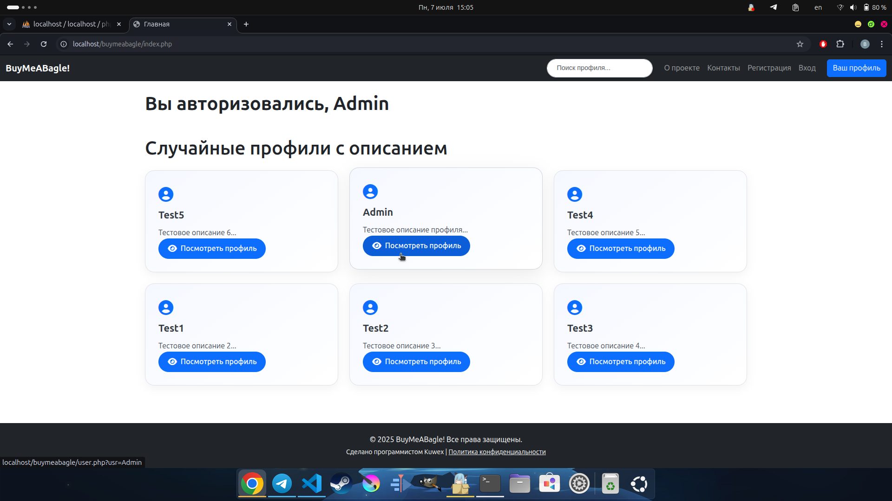

### 🧑 Регистрация
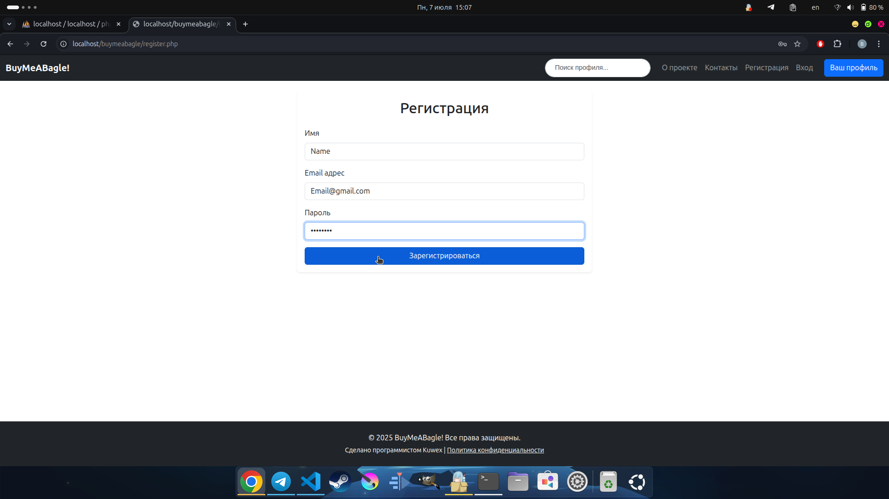

### 🔑 Вход
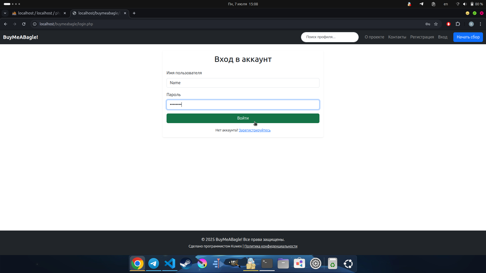

### 👤 Профиль пользователя
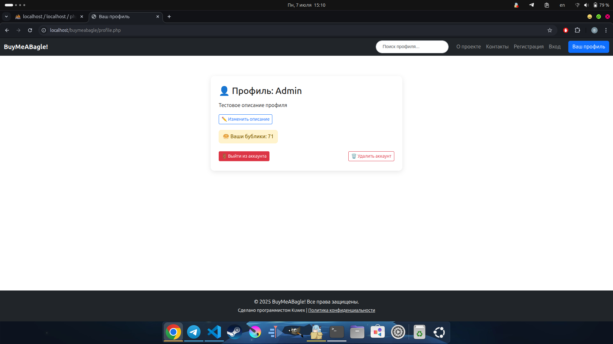

### 🎯 Создание цели
Создание и оформление сбора:
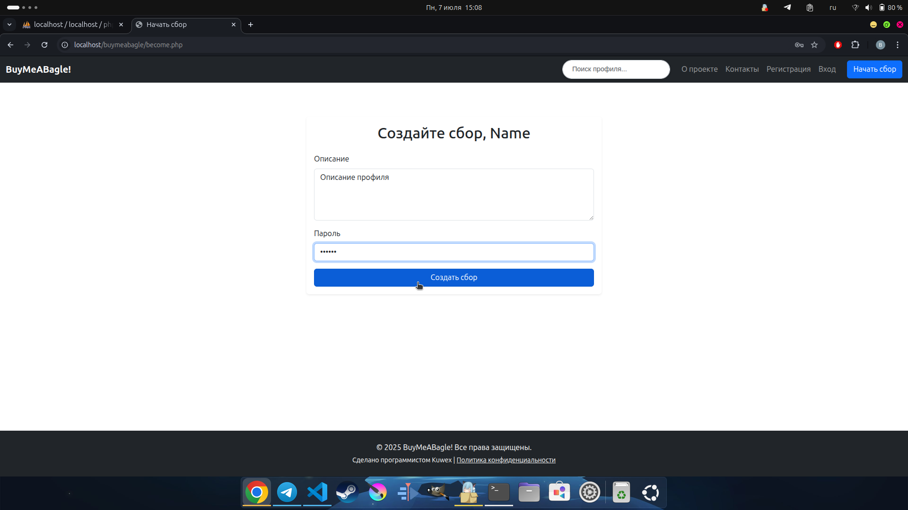

### 🥯 Донат через кнопку
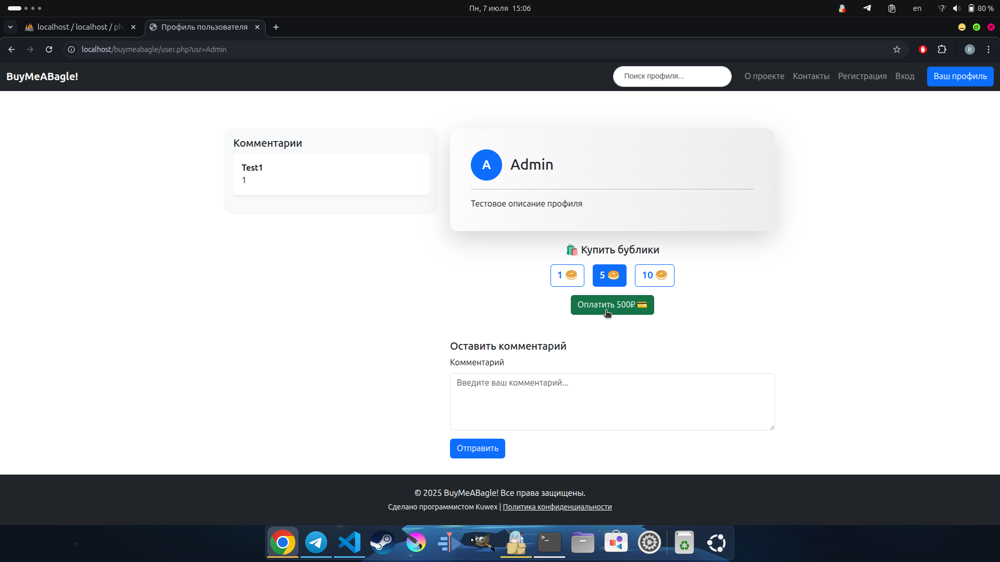

### 🔍 Поиск пользователей
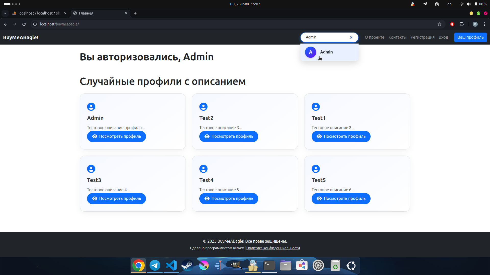

### ❌ Удаление комментария
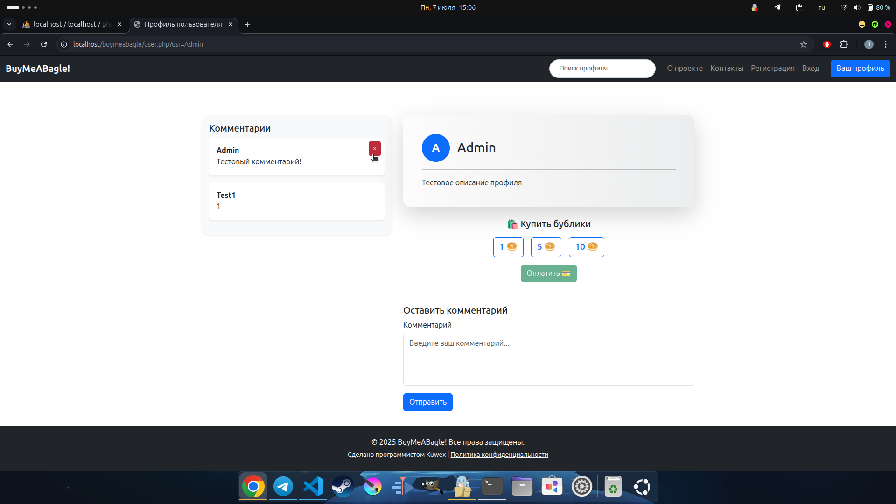

### ❌ Удаление профиля
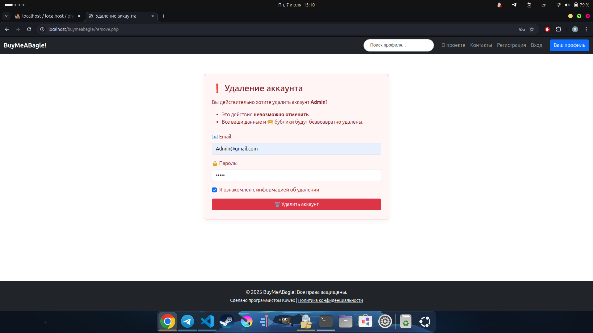

### 📬 Контакты
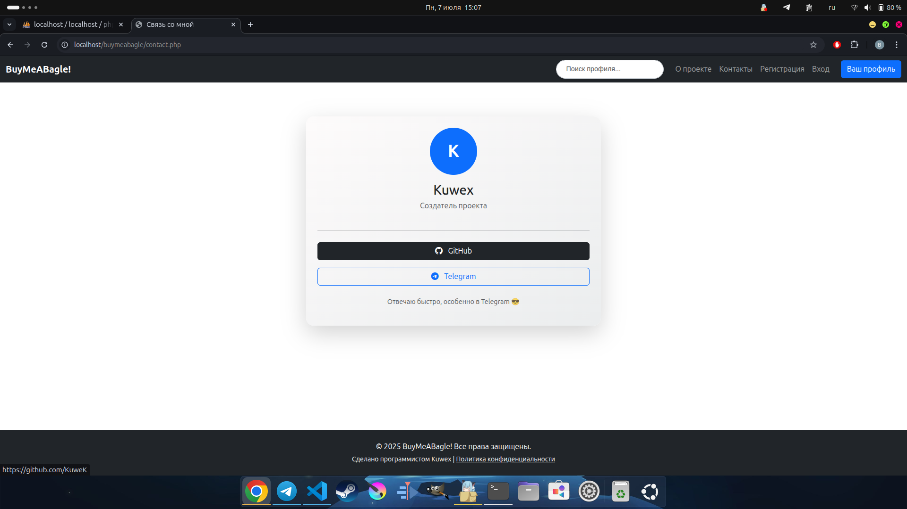

### ℹ️ О проекте
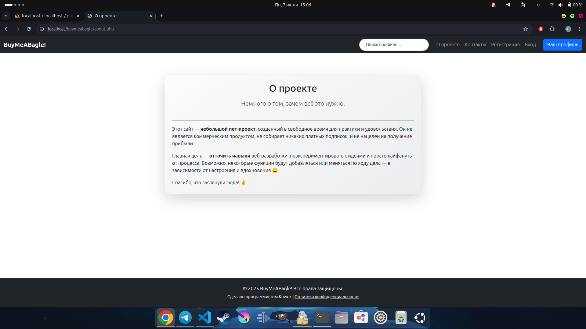

---

## ⚙️ Установка

```bash
git clone https://github.com/KuweK/BuyMeABagel.git
cd buymeabagle
# Настрой доступ к базе данных в файлах
update_desc.php,searchuser.php,searching.php,rmcomment.php,remove_handler.php,reg.php,profile.php,payment.php,newcomment.php,login_handler.php,getcomments.php,getbagels.php,get_profiles.php,create_card.php,
checkdesc.php и check_username.php
